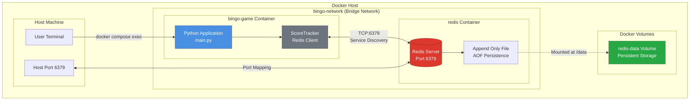
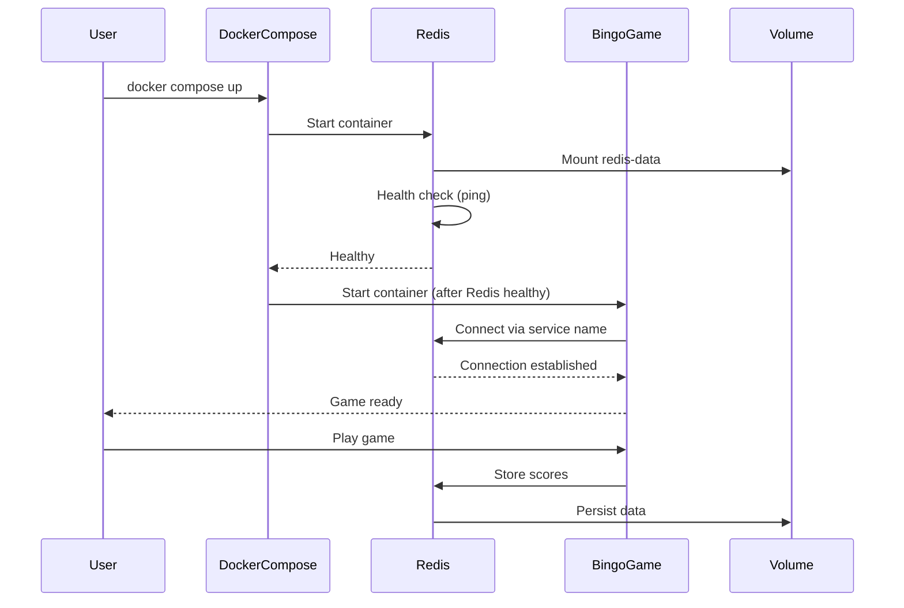
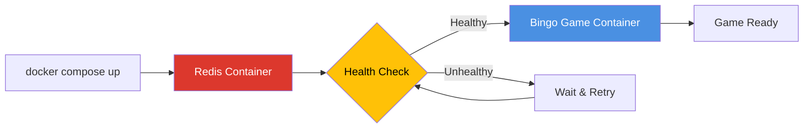

# Bingo Project Architecture

## Docker Architecture Diagram



## Component Details

### Containers

**bingo-game Container:**
- **Image**: Custom built from `bingo-game/Dockerfile`
- **Base**: `python:3.10-slim`
- **User**: Non-root (`bingo`, UID 1000)
- **Health Check**: Python process check every 30s
- **Dependencies**: Waits for Redis health check

**redis Container:**
- **Image**: `redis:alpine`
- **Port**: 6379 (exposed to host)
- **Persistence**: AOF (Append Only File) enabled
- **Health Check**: `redis-cli ping` every 10s
- **Volume**: `/data` mounted to `redis-data`

### Network

**bingo-network:**
- **Type**: Bridge network
- **Purpose**: Isolated container communication
- **Service Discovery**: Containers resolve by service name
- **Internal Communication**: No port mapping required

### Data Flow

1. **Game Initialization:**
   ```
   User → docker compose exec → bingo-game container
   → ScoreTracker initializes → Connects to Redis
   ```

2. **Gameplay:**
   ```
   Game logic → Score calculation → Redis storage
   → Volume persistence → Data survives restarts
   ```

3. **High Score Retrieval:**
   ```
   Game start → Redis query → High score display
   ```

## Deployment Sequence



## Service Dependencies



